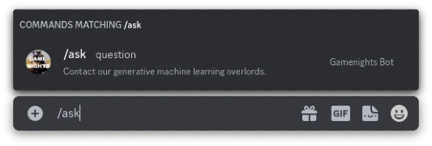

---

# DISCONTINUED
This project is now (11/10/23) discontinued. 

---


# MWT GameNights Bot

This is a Discord bot for the MWT GameNights server.

---

## Table of Contents

- [Project Requirements](#Project-Requirements)
- [Running the Bot](#Running-the-Bot)
- [Commands](#Commands)

---

## Project Requirements

- [X] Includes an economy system with a virtual currency
- [X] Users can give each other money
- [X] Users can spend their currency in Nationality and Culture channels to access random, relevant pictures

- [X] Users can align themselves with different groups
- [ ] Groups have a joint treasury managed by elected leaders
    - [X] Joint Treasury
    - [ ] Managed by leaders
- [X] Roles based on alignment can be set with a cooldown period for changing alignment

- [ ] Users can engage in sabotage by stealing money from individuals
- [ ] Success rate influenced by faction upgrades and cooldown limitations on stealing
- [ ] Sabotage will raise the price of images
- [ ] Money can only be securely stored in the faction treasury but can still be robbed to some extent
- [ ] Each faction has a net worth based on accumulated money 

---

## Running the Bot

### Prerequisites

- [Node.js](https://nodejs.org/en/)
- [npm](https://www.npmjs.com/)
- [A Discord Bot Token](https://discord.com/developers/applications)
- [A MongoDB Database](https://www.mongodb.com/)

### Installation

```bash
# Clone the repository and enter the directory
git clone https://github.com/BeauTheBeau/MWTGM.git
cd MWTGM

# Install dependencies
npm install

# Create a .env file with required environment variables
echo -e "TOKEN=<your bot token>\nMONGO_URI=<your mongo uri>"\nCLIENT_ID=<your client id>" > .env

# Start the bot
npm start
```

### Doesn't Work?
~~Cope.~~
- Open an issue and I (or someone else), will try to help you out
- If on a non Unix-like system, this may not work
- We have not tested this method of installation
- I plan to make this process easier in the future, by using [Docker](https://www.docker.com/)

---

## Commands

MWT GameNights Bot uses Discord's new [Slash Commands](https://discord.com/developers/docs/interactions/slash-commands)
feature. 
This means that all commands are available in the Discord UI. 
To use a command, type `/` in the chat and select the command you want to use. 
This also provides an easily navigable list of all commands. 

**TODO:** Complete list of commands (lol)
